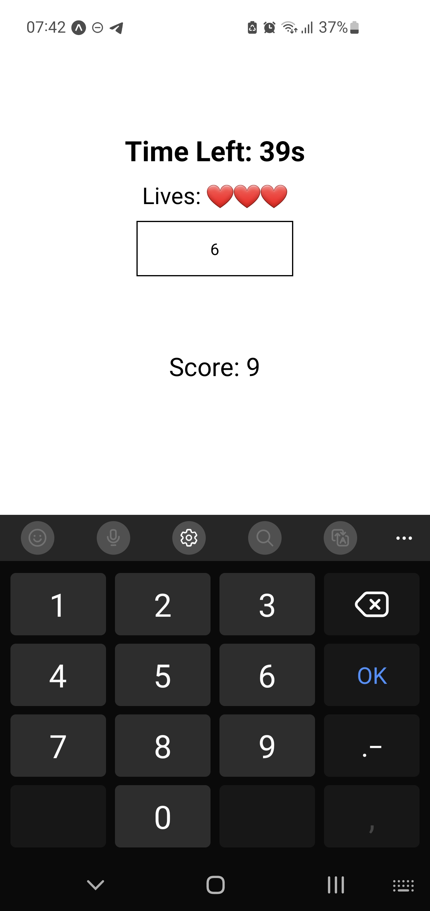

# les-nombres

Mobile game to help learners to quickly understand the numbers in French.

# local installation

1. Install [Node.js](https://nodejs.org/en/download)
2. Run `npm install`
3. Run `npx expo start`
4. Scan the QR code with your [Expo Go](https://expo.dev/go) app in your phone

# how to play

- Increase your volume
- Hear the number pronounced
- Type it in the main box
- You got 60 seconds or 3 attemps
- Good luck!

